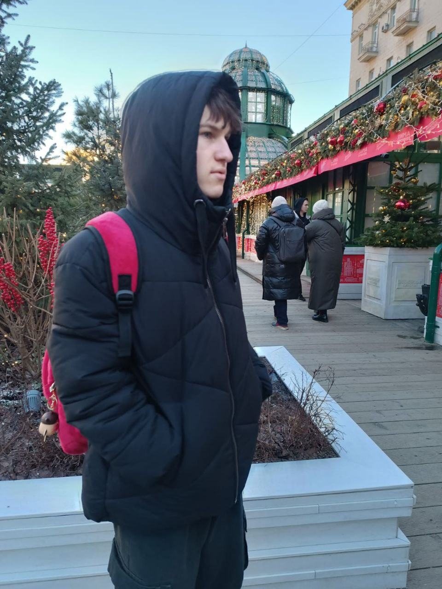

# Ivan Andreevich Semenkov
### Programmer



## Contacts
- Phone: [ +375 (29) 103-69-47](tel:+375291036947)
- Email: [qqqqqq.@gmail.com](mailto:qqqqqq.@gmail.com)

## Social Media
- **Git:** [Vanek1212](https://github.com/Vanek1212)
- **VK:** [Ivan Semenkov](https://www.vkontacte.com/Kharchenko.Kateryna)

## About Me
Second-year student, Ivan Andreevich Semenkov, group ASOIR-231.  
Web development is something I have tried before, along with other technologies. I have experience working with website builders, etc.

## Work Experience
- **No work experience at the moment**

## Education
- **Belarusian-Russian University, 2023-2027**  
  Data Processing, Bachelor's degree

## Skills
1. HTML5, CSS3
2. JavaScript
3. C#
4. C++
5. Figma
6. Photoshop
7. MySQL
8. English (intermediate level)

## Example Code
```javascript
function greet() {
    console.log("Hello, world!");
}
greet();